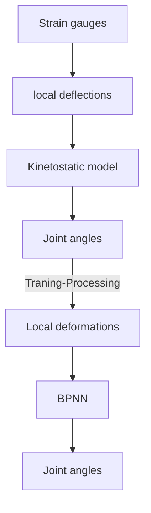
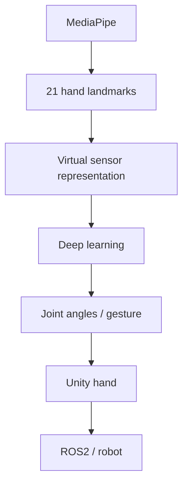
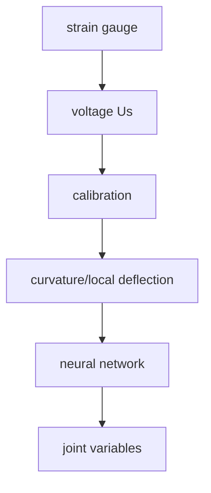
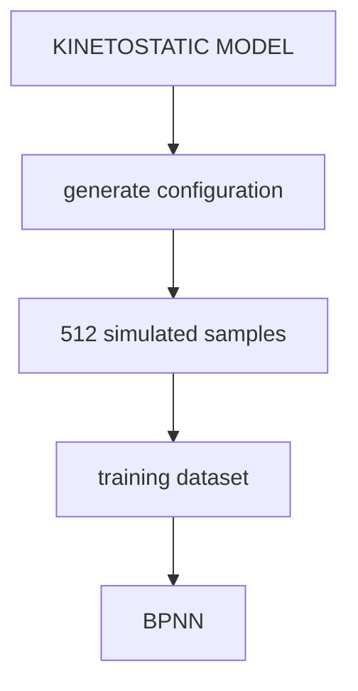

# Day 4
**Objective:**

>The objective is not merely to recognize a hand gesture, but to estimate the continuous finger joint configuration so that the human hand motion can be reconstructed in the digital twin environment.

**Question Raised:**

1. Input của neural network là gì ?
2. Output của neural network là gì ?
3. Tại sao paper cần neural network nếu đã có kinetostatic model ?
4. 512 gestures dùng để làm gì ?
5. Project của mình thày 4 strain gauges bằng Mediapipe như thế nào ?

## Review:

**Cách 1: Model-Based**

```math

\text{Sensor: `strain gauge voltage`} \\

\downarrow \\

\text{Calibration: local beam deformation} \space (\phi_{1} .. \phi_{4}) \\

\downarrow \\

\text{kinetostatic model:} \space (\theta / \text{finger configuration}) \\

\downarrow \\

\text{inverse kinematic:} \space \text{finger joint angles} \space (\alpha_1, \alpha_2, \alpha_3)
```

**Cách 2: Data-Driven**

Thay vì mỗi lần giải lại

> nonlinear equations $\rightarrow$ Newton-Raphson $\rightarrow$ solution

paper dùng:

> Neural network

để học mapping trực tiếp:

```math
\boxed{
    \text{sensor measurement}
}

\rightarrow

\boxed{
    \text{finger-joint variables}
}

```

> [!Note]
>
> Paper nói chính xác lý do là `Newton–Raphson` có `computational burden` và cần `iterative searching`, nên neural network được dùng để giảm `computational burden`

## Project Utilization:

**Current - Paper:**


**Implement in the project:**



## Deep Dive To Paper:

### Q1. Neural network của paper thực sự học cái gì?**

Paper sử dụng BPNN - Back Propagation Neural Network với 3 hidden layers (này gọi là Deep Learning :>)

và paper nói network có _103 parameters_, sử dụng `tansig` activation function

```math
f(x) = \frac{2}{1 + e^(-2x)} - 1 \\
```

$\text{Output Range: [-1, 1]}$

$\text{Central Value: 0 at x=0}$

(Ref: này có thể biến đổi từ hàm sigmoid = $2*signmoid(2x)$)

**Input:**
>local deflections của flexible beam $\phi_1$, $\phi_2$, $\phi_3$, $\phi_4$

**Output:**

>finger joint variables

Tức là configuration của ngón tay

### Q2: Tại sao không train trực tiếp từ voltage ?

theo Paper:



với công thức `Calibration` đang được giải định quan hệ tuyến tính:

```math
c = \lambda U_{s}
```

với $\lambda$ được xác định bằng calibration

$\rightarrow$ Sau calibration, có được `local bending curvature`

### Q3. Nhưng tại sao có tận 512 gestures ?

Paper **không cần người thử tạo 512 gestures**

>với mỗi finger, 512 gestures được simulated theo kinetostatic model




