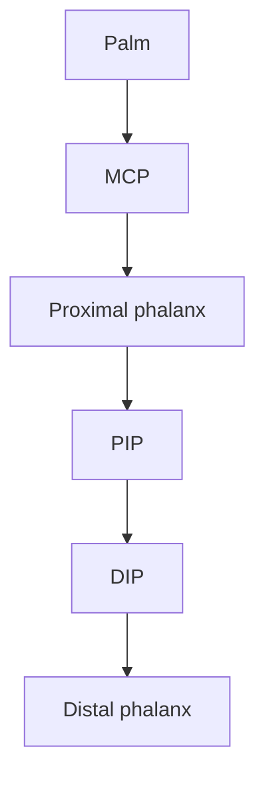

# Day 5

## Objective:

Ứng dụng Cerveri model để phát triển Virtual Sensor và thực hiện programming

Trả lời được câu hỏi
> Từ mediapipe 21 landmarks $\rightarrow$ làm thế nào để lấy được joint angles $\rightarrow$ đưa ra joint angles vào một kinematic hand model

## Processing:

### Part 1: Container "Cerveri model"

từ paper của Cerveri, có kết luận rằng:

hand = hierarchical rigid-body system

Mỗi anatomical distinct có:
- vị trí
- orientation
- hirerachy
- marker positions
- kinematic variables
- geometric properties

**Ví dụ**: với 1 ngón tay



> [!Note]:
> Trong mô hình 21 điểm (landmarks) chuẩn của `MediaPipe`, lòng bàn tay không phải là 1 điểm đơn lẻ, mà là **mặt phẳng cơ sở (palm landmarks)** được tạo bởi các điểm gốc

### Bài toán cơ sở:

Ta lấy: `PIP Joint`

Ví dụ index finger


ta đang muốn tìm 

```math
\theta_{PIP}
```
Cerveri biểu diễn 1-DoF rotation bằng rotation matrix quanh một local axis. Paper đang viết marker relation dưới dạng:

```math
P_{p} = R_{1DoF}(X,\alpha) P_{t}

```
và sau đó expand rotation matrix để tìm $\alpha$

> Điều này khá thuận lợi khi áp dụng `MediaPipe` khi đó chúng ta đã có trực tiếp 3D coordinates của các landmarks. Implement bước đầu sẽ dễ hơn

